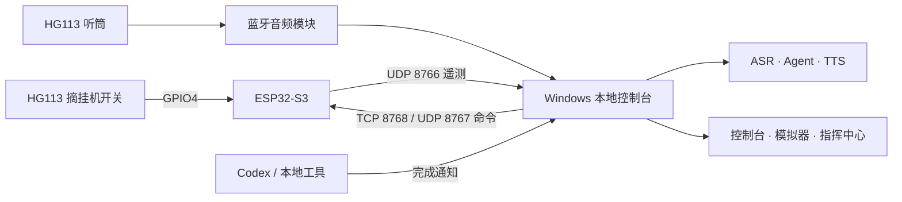

# AI Desk Phone

[](https://github.com/Damue01/AIDeskPhone/actions/workflows/ci.yml)


[](LICENSE)

把 HG113 桌面电话改造成一台本地优先的 AI 终端：拿起听筒说出任务，由 Windows 主机完成语音识别、Agent 工具调用和语音播报；任务在挂机后完成时，电话会通过 LED 与蜂鸣器提醒用户接听。

> [!WARNING]
> 本项目只复用电话外壳、听筒和低压机械结构。**不要连接公共电话网、电话外线或任何未知高压线路。**

项目目前是实验性硬件原型，面向开发者和电子制作爱好者，不是经过认证的通信设备或消费级成品。

## 已实现能力

- ESP32-S3 采集 HG113 摘挂机状态，并通过 Wi-Fi 向电脑发送遥测。
- Windows 本地控制台管理配置、硬件状态、录音、ASR、TTS、Agent 和回拨队列。
- 输入法模式可把摘挂机动作映射为 Windows 快捷键。
- Agent 模式支持流式语音识别、项目内 skill、工具调用和连续电话对话。
- Codex 或其他本地工具可通过完成通知触发电话回拨。
- 地球指挥中心展示待命、聆听、执行、等待接听和播报状态。
- 无硬件模拟模式可先验证页面、状态机、回拨与 Agent 文本入口。

## 工作原理



ESP32-S3 只负责 GPIO、Wi-Fi 和输出控制。音频、模型调用、业务状态与网页全部运行在电脑端。

## 快速开始

### 1. 无硬件体验

需要 Windows 10/11 和 Python 3.11 或 3.12。启动脚本会自动创建 `.venv` 并安装依赖：

```powershell
git clone https://github.com/Damue01/AIDeskPhone.git
Set-Location AIDeskPhone
.\Start_AI_Desk_Phone.bat simulator
```

浏览器将打开：

```text
http://127.0.0.1:8765/simulator
```

一键模拟模式会禁用串口、ESP32 UDP/TCP 链路、固件烧录和 Windows 快捷键。体验模拟器不需要 API Key。

### 2. 连接真实设备

当前已验证基线是 ESP32-S3：

| 功能 | 引脚 |
| --- | --- |
| 摘挂机输入 | GPIO4，`INPUT_PULLUP` |
| 蜂鸣器输出 | GPIO2，3 kHz PWM |
| LED 输出 | GPIO1 |
| 公共地 | GND |

完成接线、烧录和 Wi-Fi 配网后运行：

```powershell
.\Connect_Real_Device.bat
```

指定 USB 串口时：

```powershell
.\Connect_Real_Device.bat -SerialPort COM7
```

完整步骤、安全边界、成功判据和恢复方法见[标准参考手册](docs/REFERENCE_MANUAL.md)。

### 3. 启用语音与角色模型

复制环境变量模板，并只在本机填写密钥：

```powershell
Copy-Item .env.example .env
```

最小配置：

```dotenv
VOLCENGINE_API_KEY=YOUR_SPEECH_API_KEY
ARK_API_KEY=YOUR_ARK_API_KEY
```

`VOLCENGINE_API_KEY` 用于 ASR/TTS，`ARK_API_KEY` 用于 Ark Chat、通讯员润色和 Agent 回复。两者可能来自不同的授权体系。

## 支持状态

| 组件 | 状态 | 说明 |
| --- | --- | --- |
| Windows 10/11 | 主要目标 | 快捷键、音频和启动脚本均为 Windows 优先 |
| Python 3.11 / 3.12 | 支持 | 启动脚本按 3.12、3.11、`python` 顺序尝试 |
| ESP32-S3 DevKitC-1 | 当前基线 | PlatformIO 环境为 `esp32s3_gpio0_21_test` |
| ESP32-C3 | 历史/诊断 | 目录名和部分诊断固件保留 C3 命名，不代表当前推荐硬件 |
| 无硬件模拟 | 支持 | 使用 `Start_AI_Desk_Phone.bat simulator` |
| macOS / Linux | 未支持 | 后端部分能力可能运行，但快捷键、音频和脚本未经验证 |

## 文档

| 文档 | 内容 |
| --- | --- |
| [文档中心](docs/README.md) | 权威文档入口与维护规则 |
| [标准参考手册](docs/REFERENCE_MANUAL.md) | 安装、接线、固件、配置、使用、验证与故障排查 |
| [API 参考](docs/API_REFERENCE.md) | HTTP、SSE、ESP32 命令协议与指挥中心 JS Bridge |
| [硬件资料索引](docs/electronics/README.md) | 参考接线图、样机照片和历史硬件说明 |
| [参考物料清单](docs/electronics/BOM.md) | 当前 ESP32-S3 样机的数量、规格、替代件和供电边界 |
| [隐私与本地数据](PRIVACY.md) | 本地保存、第三方数据流、保留与清理边界 |
| [分支与发布规则](GOVERNANCE.md) | 两条长期分支、版本号和发布检查表 |
| [依赖与发行清单](docs/DEPENDENCIES.md) | 直接依赖、手动更新策略和发行 SBOM 要求 |
| [指挥中心组件](web/variant-earth-command-center/README.md) | 页面职责、开发入口与联网依赖 |
| [贡献指南](CONTRIBUTING.md) | 开发环境、测试、文档规则和 PR 检查项 |
| [安全策略](SECURITY.md) | 漏洞报告和受支持范围 |
| [威胁模型](THREAT_MODEL.md) | 电气、网络、密钥、模型与命令执行边界 |

## 项目结构

```text
config/      本地控制台默认配置
docs/        参考手册、API 与硬件资料
firmware/    ESP32 主固件和诊断工程
scripts/     Windows 实机连接脚本
tests/       状态机、Agent、硬件、Hook 与语音单元测试
tools/       Python 控制台、Agent runtime、语音与 Hook 客户端
web/         地球指挥中心页面
```

## 开发与测试

```powershell
py -3.12 -m venv .venv
.\.venv\Scripts\python.exe -m pip install -r requirements.txt
.\.venv\Scripts\python.exe -m unittest discover tests -v
```

编译当前 ESP32-S3 固件：

```powershell
.\.venv\Scripts\platformio.exe run `
  -d firmware\esp32c3_gpio0_21_test `
  -e esp32s3_gpio0_21_test
```

提交改动前请阅读 [CONTRIBUTING.md](CONTRIBUTING.md)。硬件相关 PR 必须说明板型、引脚、固件环境和实机验证结果。

## 安全与隐私

- HTTP 控制台默认只绑定 `127.0.0.1`，API 没有身份认证；不要将其反向代理或暴露到公网。
- ESP32 的 UDP/TCP 链路面向可信局域网，没有加密、签名或设备认证。
- `.env` 包含密钥；`data/` 可能保存录音、TTS 文件和 Agent 会话，`logs/` 可能包含调试信息。
- 启用 ASR、TTS、Ark 或网页搜索后，相关音频或文本会发送给对应的第三方服务。
- 默认 `confirm_sensitive` 权限不允许 Agent 执行 shell；只有显式切换到受信任权限后才会开放命令工具。

本地文件默认不会自动过期；详细数据流和清理方式见 [PRIVACY.md](PRIVACY.md)，安全边界见 [SECURITY.md](SECURITY.md) 和 [THREAT_MODEL.md](THREAT_MODEL.md)。

## 参与贡献

Bug、功能建议和文档问题请使用仓库的 Issue 模板。提交 PR 前，请确认测试通过、文档与行为同步，并移除密钥、Wi-Fi 凭据、个人路径和未脱敏日志。

项目协作遵循 [CODE_OF_CONDUCT.md](CODE_OF_CONDUCT.md)。第三方代码、地图和素材说明见 [THIRD_PARTY_NOTICES.md](THIRD_PARTY_NOTICES.md)。

## 许可证

项目自身代码采用 [MIT License](LICENSE)，Copyright (c) 2026 Damue01。第三方组件、素材和在线服务仍分别遵循 [THIRD_PARTY_NOTICES.md](THIRD_PARTY_NOTICES.md) 中列出的上游条款。
