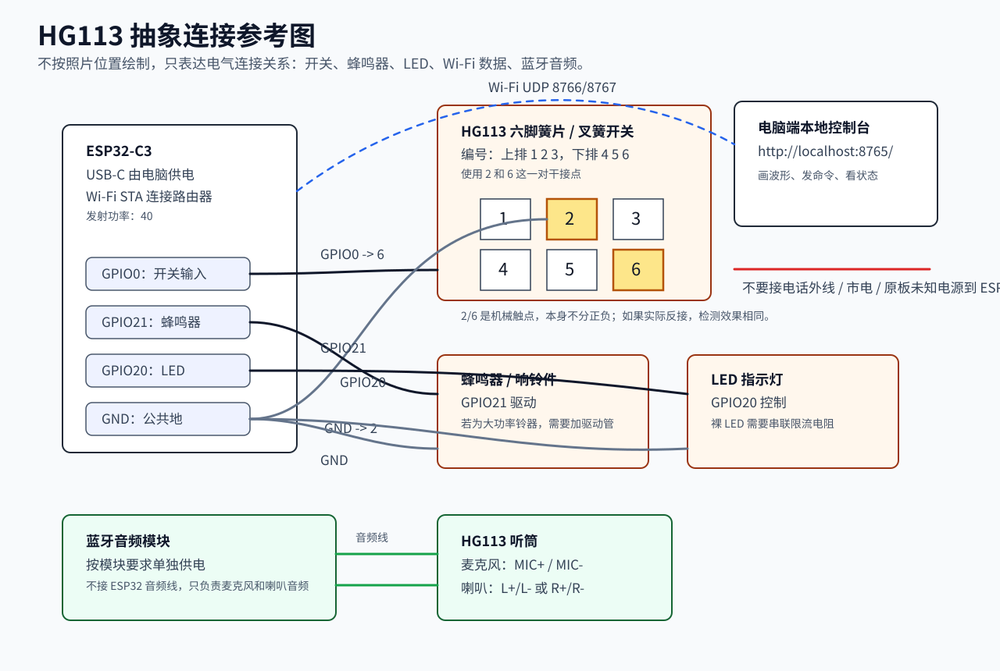

# HG113 连接手册

本文记录 HG113 电话改造接线方式。本方案不是蓝牙键盘方案，也不是 ESP32 自己托管网页；ESP32-C3 只负责采集状态、通过 Wi-Fi 发数据、接收电脑端命令并驱动蜂鸣器/LED。网页、波形和按钮控制都由电脑端本地控制台完成。

## 1. 系统结构

```text
HG113 摘挂机触点
  -> ESP32-C3 GPIO0
  -> Wi-Fi UDP 数据
  -> 电脑端本地控制台
  -> http://localhost:8765/ 显示波形和状态

电脑端网页按钮
  -> UDP/串口命令
  -> ESP32-C3
  -> GPIO21 蜂鸣器 / GPIO20 LED

听筒麦克风/喇叭
  -> 蓝牙耳机音频模块
  -> 电脑蓝牙音频输入/输出
```

ESP32-C3 不处理通话音频。蓝牙耳机模块不参与 GPIO、蜂鸣器和 Wi-Fi 控制。

抽象参考图：



## 2. 已验证硬件连接

| 功能 | ESP32-C3 引脚 | 电话/外设端 | 说明 |
| --- | --- | --- | --- |
| 摘挂机检测 | GPIO0 | 六脚簧片/叉簧开关 6 号脚 | 使用内部上拉，触点闭合到 GND 时读 LOW |
| 摘挂机检测地线 | GND | 六脚簧片/叉簧开关 2 号脚 | 2-6 这一对触点 |
| 蜂鸣器 | GPIO21 | 蜂鸣器信号/正端 | 可通过网页和 UDP 命令测试 |
| 蜂鸣器地线 | GND | 蜂鸣器负端 | 必须与 ESP32-C3 共地 |
| LED | GPIO20 | LED 信号/正端 | 固件中蜂鸣器响时会同步点亮 LED |
| LED 地线 | GND | LED 负端 | 裸 LED 需要串联限流电阻 |
| ESP32-C3 供电 | USB-C | 电脑 USB | 主供电方式 |
| 音频通信 | 不接 ESP32 | 蓝牙耳机模块 | 听筒麦克风/喇叭走蓝牙音频模块 |

默认固件引脚：

```text
GPIO0  = 开关输入
GPIO21 = 蜂鸣器输出
GPIO20 = LED 输出
```

## 3. HG113 六脚簧片开关编号

簧片开关编号：

```text
第一排：1 2 3
第二排：4 5 6
```

参考连接：

```text
ESP32-C3 GPIO0 -> 6 号脚
ESP32-C3 GND   -> 2 号脚
```

2 和 6 是同一对机械干接点，本身不分正负。文档为了统一画成 GPIO0 接 6、GND 接 2；如果现场实际是 GPIO0 接 2、GND 接 6，也能工作。

固件把 GPIO0 设置为 `INPUT_PULLUP`：

```text
触点断开：GPIO0 被 ESP32 内部上拉为 HIGH
触点闭合：GPIO0 被 2-6 触点拉到 GND，读 LOW
```

固件里的逻辑名称：

```text
HIGH -> ON_HOOK
LOW  -> OFF_HOOK
```

如果机械方向和显示名称反了，优先在固件/网页里反转逻辑，不建议现场乱换线。

## 4. 开关接线注意事项

只把 2-6 这一对当作干接点使用：

```text
GPIO0 ---- 6 号脚
GND   ---- 2 号脚
```

不要这样接：

```text
ESP32-C3 3V3 -> 电话原板/叉簧开关
电话原板电源 -> ESP32-C3 GPIO0
电话外线     -> ESP32-C3
市电         -> 电话板
```

“一接上就一直 LOW / 被 3.3V 拉起来”的常见根因，是原电话板和 ESP32 的上拉、电源状态互相影响。原则是：开关只作为普通机械触点，一端 GPIO，一端 GND，不把电话原板电源混进去。

## 5. 蜂鸣器连接

接法：

```text
ESP32-C3 GPIO21 -> 蜂鸣器信号/正端
ESP32-C3 GND    -> 蜂鸣器负端
```

网页按钮：

```text
蜂鸣器响一下 -> beep
持续响       -> ring_on
停止         -> ring_off
```

固件命令也支持：

```text
beep
ring_on
ring_off
buzzer_on
buzzer_off
```

注意：

1. 如果是有源蜂鸣器模块，按模块标注接 VCC/GND/信号。
2. 如果是裸蜂鸣片、线圈、原电话大铃器，GPIO 可能推不动，需要加三极管或驱动模块。
3. 如果网页显示命令发送成功但蜂鸣器不响，检查蜂鸣器类型、供电、极性和驱动能力。

## 6. LED 连接

固件默认：

```text
ESP32-C3 GPIO20 -> LED 信号/正端
ESP32-C3 GND    -> LED 负端
```

固件行为：

```text
蜂鸣器 ON  -> LED ON
蜂鸣器 OFF -> LED OFF
```

网页按钮也支持单独测试：

```text
LED 点亮 -> led_on
LED 熄灭 -> led_off
```

注意：裸 LED 必须串联限流电阻。没有电阻时，不要长期把裸 LED 直接挂在 GPIO 和 GND 之间。若使用电话原板上的 LED，不要直接驱动整块原板电路，先确认 LED 两端和限流路径。

## 7. 蓝牙音频模块

音频链路和 ESP32 控制链路分开：

```text
听筒麦克风 -> 蓝牙耳机模块 MIC+/MIC-
听筒喇叭   -> 蓝牙耳机模块 L+/L- 或 R+/R-
蓝牙模块   -> 电脑蓝牙音频设备
```

注意：

1. 喇叭输出通常是差分输出，不要随便把 `L- / R-` 接到 GND。
2. 麦克风正负、喇叭正负以实测为准，不只看线颜色。
3. 蓝牙音频模块供电按模块要求来，不从 GPIO 取电。
4. ESP32-C3 不接麦克风音频线，也不接喇叭音频线。

## 8. Wi-Fi 通信方案

Wi-Fi 通信使用：

```text
Wi-Fi SSID: 使用本地 2.4 GHz Wi-Fi，真实 SSID 写在本机忽略文件里
频段: 2.4 GHz
ESP32-C3 DHCP IP: 192.168.71.11
```

IP 由路由器分配，可能变化，不要写死在业务逻辑里。

固件关键设置：

```text
Arduino-ESP32: 3.3.9
Wi-Fi 发射功率: 40
遥测 UDP 端口: 8766
命令 UDP 端口: 8767
```

`40` 表示约 `10 dBm`。这次 Wi-Fi 稳定连接的关键之一就是把发射功率从高功率降到 `40`。

固件配置文件：

```text
firmware/esp32c3_gpio0_21_test/include/wifi_credentials.h
```

格式：

```cpp
#pragma once

#define WIFI_STA_SSID "你的 Wi-Fi 名称"
#define WIFI_STA_PASSWORD "你的 Wi-Fi 密码"
```

这个文件已被 `.gitignore` 忽略，不要提交真实密码。

## 9. 电脑端控制台

启动：

```powershell
.\.venv\Scripts\python.exe tools\ai_desk_phone_console.py --port COM5
```

打开：

```text
http://localhost:8765/
```

页面功能：

1. 看 GPIO0 开关状态和波形。
2. 看 Wi-Fi 状态、IP、RSSI。
3. 点按钮测试蜂鸣器。
4. 点按钮测试 LED。
5. 修改测试引脚。

电脑端会同时支持：

```text
USB 串口：调试和兜底控制
UDP：Wi-Fi 遥测和命令
```

## 10. 固件编译和烧录

编译主固件：

```powershell
.\.venv\Scripts\platformio.exe run -d firmware\esp32c3_gpio0_21_test
```

主固件平台使用：

```ini
platform = https://github.com/pioarduino/platform-espressif32/releases/download/stable/platform-espressif32.zip
framework = arduino
```

如果普通上传遇到 Windows 终端编码问题，使用下面方式烧录整包：

```powershell
$env:PYTHONIOENCODING='utf-8'
& "$env:USERPROFILE\.platformio\penv\Scripts\esptool.exe" `
  --chip esp32c3 `
  --port COM5 `
  --baud 115200 `
  --before default-reset `
  --after hard-reset `
  write-flash -z 0x0 `
  firmware\esp32c3_gpio0_21_test\.pio\build\esp32c3_gpio0_21_test\firmware.factory.bin
```

## 11. 运行检查

主固件运行时应能看到：

```text
Wi-Fi: connected
SSID: 使用本地 2.4 GHz Wi-Fi，真实 SSID 写在本机忽略文件里
IP: 192.168.71.11
RSSI: 约 -55 dBm
90 秒串口观察: 0 次 Wi-Fi 断开
UDP 遥测: 可收到
UDP 命令: 可触发蜂鸣器 ON/OFF
本地网页: http://localhost:8765/ 可打开
网页 beep 接口: {"ok": true}
```

## 12. 排查表

### 网页打不开

检查控制台是否启动：

```powershell
Get-NetTCPConnection -LocalPort 8765
```

重新启动：

```powershell
.\.venv\Scripts\python.exe tools\ai_desk_phone_console.py --port COM5
```

### Wi-Fi 连不上

先看串口或网页里的字段：

```text
wifi_connected
wifi_ip
wifi_rssi
wifi_disconnect_reason
```

重点确认：

1. `wifi_credentials.h` 里 SSID/密码正确。
2. 使用稳定的 2.4 GHz 网络；真实 SSID 和密码只写入本机忽略文件。
3. 固件平台是 Arduino-ESP32 3.3.9。
4. `WIFI_TX_POWER_QUARTER_DBM = 40`。
5. 不要退回旧的 `platformio/espressif32 @ 7.0.1` 平台。

### GPIO0 一直接 LOW

检查：

```text
GPIO0 是否接到 6 号脚
GND 是否接到 2 号脚
是否误接电话原板 3.3V
是否误把原电话板电源混入开关触点
```

正确原则：2-6 只作为机械触点使用，一端 GPIO0，一端 GND。

### 蜂鸣器不响

检查：

```text
GPIO21 -> 蜂鸣器信号/正端
GND    -> 蜂鸣器负端
网页 beep 是否返回 {"ok": true}
串口是否出现 "buzzer":"ON"
```

如果串口显示 ON 但实际不响，说明 GPIO 命令已到板子，问题在蜂鸣器类型、供电、极性或驱动能力。

### LED 不亮

检查：

```text
GPIO20 -> LED 正端/信号端
GND    -> LED 负端
是否串联限流电阻
是否接的是原电话板上的复杂 LED 电路
```

GPIO 能控制的是简单 LED 或 LED 模块，不一定能直接驱动原电话板上的整段电路。

## 13. 最小复查清单

每次拆装后按这个顺序复查：

1. ESP32-C3 USB 接电脑，能看到 COM5。
2. 打开 `http://localhost:8765/`。
3. 页面能看到开关波形。
4. 操作听筒，GPIO0 状态变化。
5. 点“蜂鸣器响一下”，蜂鸣器响。
6. 点 LED，LED 亮/灭。
7. 页面显示 Wi-Fi connected。
8. 页面显示 ESP32 IP。
9. 蓝牙音频模块能在电脑里作为音频设备使用。
10. 装回外壳后线束不压住机械开关。
